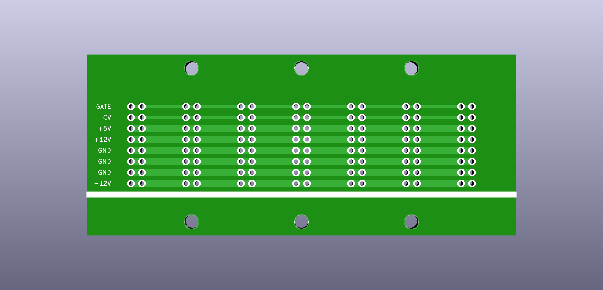

# Eurorack Bus Board

This bus board has seven comfortably spaced positions for pin headers or box headers for IDC connectors (16-pos., 2.54 mm).

Dimensions: 99.06 x 41.91 mm

Mounting hole pattern: 50.8 (25.4) x 35.56 mm (~3 mm hole diameter)

Mounting hole pattern (alternative): 76.2 (50.8) (25.4) x 35.56 mm (~3 mm hole diameter)
